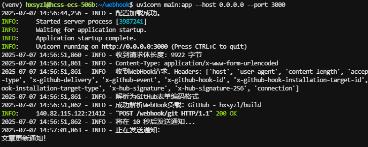
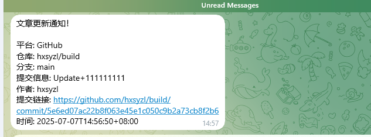

# WebHook Notifier

[](https://www.python.org/)
[](https://fastapi.tiangolo.com/)

一个灵活、自托管的通知服务，用于接收来自 **GitHub、GitLab、Gitea、Gogs** 的 Git 推送事件、**Netlify** 部署状态和 **RSS 订阅**更新，然后将格式化的消息分发到 **Telegram、电子邮件和 QQ** 等多个平台。

---

## 核心功能

- **多平台 Git 支持**：原生支持来自 GitHub、GitLab、Gitea 和 Gogs 的 `push` 事件 WebHook。
- **Netlify 部署通知**：支持接收来自 Netlify 的部署状态更新 WebHook。
- **全面的 RSS 监控**：
    - **定时轮询**：可配置间隔时间，自动检查 RSS 源的更新。
    - **WebHook 接入**：提供 `/webhook/rss` 端点，支持 RSS to WebHook 服务（如 rss-to-webhook.com）的实时推送。
- **多渠道通知**：
    - Telegram Bot (支持长消息分段发送)
    - 电子邮件 (SMTP)
    - Napcat (QQ Bot)
- **安全可靠**：
    - **签名验证**：验证来自 GitHub (sha1/sha256) 和 Gitea (sha256) 的 WebHook 签名，确保请求来源可信。
    - **Token 验证**：支持 GitLab 的 `X-Gitlab-Token` 验证。
    - **RSS 去重**：自动记录已推送的文章，防止因源更新导致的重复通知。
- **高度可配置**：
    - **集中配置**：所有功能均通过一个 `config.yaml` 文件进行管理。
    - **通知延迟**：可设置一个全局延迟，在接收到事件后等待一段时间再发送通知。
    - **代理支持**：支持为所有出站 HTTP 请求（Telegram, Napcat, RSS抓取）配置代理。

## 工作流程

```
            +---------------------------+
 Git Push   |                           |   +------------------+
 (GitHub,   |                           |   |                  |
 GitLab,    +---> Git & RSS WebHook     +---> Telegram         |
 Gitea,Gos)     |        Notifier           |   |                  |
            |                           |   +------------------+
 RSS Update |                           |
 (Polling/  |                           |   +------------------+
  Webhook)  +---> (Configurable Delay)  +---> Email (SMTP)     |
            |                           |   |                  |
            |                           |   +------------------+
            |                           |
            |                           |   +------------------+
            |                           |   |                  |
            +---------------------------+   +---> QQ           |
                                            |                  |
                                            +------------------+
```

## 安装与启动

#### 1. 克隆仓库

```bash
git clone https://github.com/hxsyzl/WebHook-Notifier.git
cd WebHook-Notifier
```

#### 2. 安装依赖

项目依赖于以下 Python 包。强烈建议在虚拟环境中使用 `pip` 进行安装，以避免与系统级的 Python 包产生冲突。

##### 2.1. 创建并激活虚拟环境

在项目根目录下，根据你的操作系统执行以下命令：

**Windows:**

```bash
# 创建名为 venv 的虚拟环境
python -m venv venv
# 激活虚拟环境
.\venv\Scripts\activate
```

**macOS / Linux:**

```bash
# 创建名为 venv 的虚拟环境
python3 -m venv venv
# 激活虚拟环境
source venv/bin/activate
```

成功激活后，你的命令行提示符前通常会显示 `(venv)` 字样。

##### 2.2. 安装依赖包

```
# requirements.txt
fastapi
uvicorn[standard]
PyYAML
httpx
feedparser
```

```bash
pip install -r requirements.txt
```

#### 3. 编辑配置文件

根据你的需求进行配置文件模板修改。

```bash
nano config.yaml
```

详细的配置说明请参见下一章节。

#### 4. 启动服务

使用 `uvicorn` 启动应用。

```bash
# 在开发环境中，使用 --reload 参数可以在代码变更后自动重启服务
uvicorn main:app --host 0.0.0.0 --port 8000 --reload

# 在生产环境中，建议不使用 --reload
uvicorn main:app --host 0.0.0.0 --port 8000
```

服务启动后，你可以在 `http://<your-server-ip>:8000` 看到欢迎信息。

欢迎信息类似于：{"message":"WebHook Notifier 服务正在运行","version":"1.1.0","endpoints":{"git_webhook":"/webhook/git","rss_webhook":"/webhook/rss"}}


## 效果展示


## 配置 (`config.yaml`)

这是所有配置的核心。以下是一个包含所有可用选项的示例：

```yaml
# 全局设置
global:
  # 接收到事件后，延迟多少秒再发送通知。设为 0 表示立即发送。
  notification_delay_seconds: 5
  # 代理设置 (适用于 Telegram, Napcat, RSS抓取)
  proxy:
    enabled: false
    # 代理地址，例如 http://127.0.0.1:7890 或 socks5://127.0.0.1:1080
    url: "http://127.0.0.1:7890"

# Git 平台设置
github:
  # 在 GitHub WebHook 设置中填写的 Secret
  secret: "your_github_webhook_secret"

gitlab:
  # 在 GitLab WebHook 设置中填写的 Secret Token
  secret: "your_gitlab_webhook_secret"

gitea:
  # 在 Gitea WebHook 设置中填写的 Secret
  secret: "your_gitea_webhook_secret"

gogs:
  # 在 Gogs WebHook 设置中填写的 Secret
  secret: "your_gogs_webhook_secret"

# Netlify 设置
netlify:
  # 在 Netlify WebHook 设置中填写的 Secret
  secret: "your_netlify_webhook_secret"

# RSS 订阅设置
rss:
  enabled: true
  # 自动检查 RSS 更新的间隔时间（分钟）
  check_interval_minutes: 30
  # RSS WebHook 设置
  webhook:
    # 用于验证 RSS to WebHook 服务请求的 Secret (可选)
    secret: "your_rss_webhook_secret"
  # 要监控的 RSS 源列表
  feeds:
    - name: "Awesome RSS"
      url: "https://example.com/feed.xml"
      enabled: true
    - name: "Another Feed"
      url: "https://another.com/rss"
      enabled: true

# 通知渠道设置
telegram:
  enabled: true
  bot_token: "123456:ABC-DEF1234ghIkl-zyx57W2v1u123ew11"
  chat_id: "-1001234567890" # 或个人用户的 chat_id

email:
  enabled: false
  smtp_server: "smtp.example.com"
  smtp_port: 587
  smtp_username: "user@example.com"
  smtp_password: "your_email_password_or_app_token"
  sender_email: "notifier@example.com"
  recipient_emails:
    - "recipient1@example.com"
    - "recipient2@example.com"
  # 如果 SMTP 端口是 465，通常需要将 use_ssl 设为 true
  use_ssl: false
  # 如果 SMTP 端口是 587，通常需要将 use_tls 设为 true
  use_tls: true

napcat:
  enabled: false
  # Napcat HTTP API 的基础 URL
  base_url: "http://127.0.0.1:3001"
  # 发送模式: private (私聊), group (群聊), all (两者都发)
  send_mode: "all"
  # 私聊 QQ 号
  user_id: "10001"
  # 群聊群号
  group_id: "123456789"
```

## 使用方法

### 1. 配置 Git WebHook

在你的 GitHub/GitLab/Gitea/Gogs 仓库设置中，添加一个新的 WebHook：

- **Payload URL / 目标 URL**: `http://<your-server-ip>:8000/webhook/git`
- **Content Type / 内容类型**: `application/json` (推荐) 或 `application/x-www-form-urlencoded`
- **Secret / 密钥**: 填写你在 `config.yaml` 中为对应平台设置的 `secret`。
- **Events / 触发事件**: 选择 `push` 或 "推送事件"。

### 2. 配置 Netlify WebHook

在你的 Netlify 站点设置中，配置部署通知 WebHook：

- **Webhook URL**: `http://<your-server-ip>:8000/webhook/netlify`
- **Secret / 密钥**: 填写你在 `config.yaml` 中为 Netlify 设置的 `secret`。

### 2. 配置 RSS

#### 方式一：自动轮询 (推荐)

只需在 `config.yaml` 的 `rss.feeds` 列表中添加你想要监控的 RSS 地址，并确保 `rss.enabled` 为 `true`。服务启动后会自动按 `check_interval_minutes` 定义的周期进行检查。

#### 方式二：使用 WebHook

如果你希望获得更实时的 RSS 更新，可以使用 rss-to-webhook 或类似的第三方服务。

- **Webhook URL**: `http://<your-server-ip>:8000/webhook/rss`
- 在第三方服务中配置你的 RSS 源，并将其指向以上 URL。
- （可选）如果第三方服务支持，可以配置一个 `secret` 并填入 `config.yaml` 的 `rss.webhook.secret` 中以增加安全性。

## API 端点

- `GET /`
  - 返回服务的运行状态和版本信息。
- `POST /webhook/git`
  - 接收来自 Git 平台的 WebHook 请求。
- `POST /webhook/rss`
  - 接收来自 RSS to WebHook 服务的请求。
- `POST /webhook/generic`
  - 接收通用的 WebHook 请求。
- `POST /webhook/netlify`
  - 接收来自 Netlify 的部署状态更新请求。

## 数据持久化

服务会在应用根目录创建一个 `rss_last_check.json` 文件，用于存储已见过的 RSS 文章ID，以防止重复通知。请确保应用对此文件有读写权限。该文件会在服务正常关闭时自动保存。

## 行为准则

本项目遵循 Contributor Covenant 行为准则。期望所有参与者都能遵守此准则，共同营造一个友善、包容和健康的技术社区环境。

### 我们的承诺

身为社区成员、贡献者和领导者，我们承诺使社区参与者不受骚扰，无论其年龄、体型、可见或不可见残疾、种族、性别特征、性别认同和表达、经验水平、教育程度、社会经济地位、国籍、个人外貌、种族、宗教或性认同和取向如何。

我们承诺以有助于建立开放、包容和健康社区的方式进行互动。

### 我们的标准

有助于创造积极环境的行为包括：

* 使用欢迎和包容性语言
* 尊重不同的观点和经历
* 优雅地接受建设性批评
* 关注对社区最有利的事情
* 对其他社区成员表示同情

不可接受的行为包括：

* 使用性化语言或图像，以及任何类型的性关注或挑逗
* 侮辱性、贬损性评论和人身或政治攻击
* 公开或私下骚扰
* 未经明确许可发布他人的私人信息，如物理或电子邮件地址
* 其他可能在专业环境中被合理认为不适当的行为

### 执行责任

社区领导者负责澄清和执行我们的行为标准，并会采取适当和公平的纠正措施来回应任何他们认为不适当、威胁性、攻击性或有害的行为。

社区领导者有权利和责任删除、编辑或拒绝与本行为准则不一致的评论、提交、代码、维基编辑、问题和其他贡献，并在必要时进行沟通以解释适度决定的原因。

### 执行范围

当个人在社区范围内代表项目或其社区时，本行为准则适用于所有社区空间和公共场所。

代表社区的方式包括使用官方电子邮件地址、通过官方社交媒体账户发布内容，或在线或线下活动中担任指定代表。

### 执行

如遇辱骂、骚扰或其他不可接受的行为，可以通过项目团队提供的联系方式报告。所有投诉都将得到及时和公正的审查和调查。

所有社区领导者都有义务尊重任何事件报告者的隐私和安全。

### 执行指南

社区领导者将遵循这些社区影响指南来确定他们认为违反本行为准则的行为的后果：

#### 1. 更正

**社区影响**：使用不当语言或其他在社区中被认为不专业的行为。

**后果**：由社区领导者私下书面警告，明确说明违规行为的性质，并解释为什么该行为不适当。可能会要求公开道歉。

#### 2. 警告

**社区影响**：单个或一系列违规行为。

**后果**：警告违规后果。在指定时间内，不得与相关人员互动，包括主动与行为准则执行者互动。这包括避免在社区空间和外部渠道中的互动。违反这些条款可能会导致临时或永久封禁。

#### 3. 临时封禁

**社区影响**：严重违反社区标准，包括持续的不当行为。

**后果**：在指定时间内暂时禁止与社区进行任何形式的互动或公开交流。在此期间，不得与相关人员私下互动，包括主动与行为准则执行者互动。违反这些条款可能会导致永久封禁。

#### 4. 永久封禁

**社区影响**：演示违反社区标准的模式，包括持续的不当行为、骚扰个人或攻击或贬低类别的个人。

**后果**：永久禁止在社区内进行任何形式的公开互动。

### 来源

本行为准则改编自 [Contributor Covenant][homepage] 版本 2.1，可在 https://www.contributor-covenant.org/version/2/1/code_of_conduct.html 查看。

社区影响指南灵感来自 [Mozilla's code of conduct enforcement ladder](https://github.com/mozilla/diversity).

[homepage]: https://www.contributor-covenant.org

有关本行为准则的常见问题解答，请参见 https://www.contributor-covenant.org/faq。其他语言的翻译可在 https://www.contributor-covenant.org/translations 获得。

## Netlify 部署

本项目的 Web 管理界面已部署在 [Netlify](https://www.netlify.com/) 上。Netlify 为我们提供了简单而强大的静态网站托管服务，支持持续部署、自定义域名、全球 CDN 等功能，极大地简化了前端部署流程。

如果您对本项目的 Web 管理界面感兴趣，可以通过访问我们的 [Netlify 站点](http://webhookui.497995.xyz) 来查看和使用。
